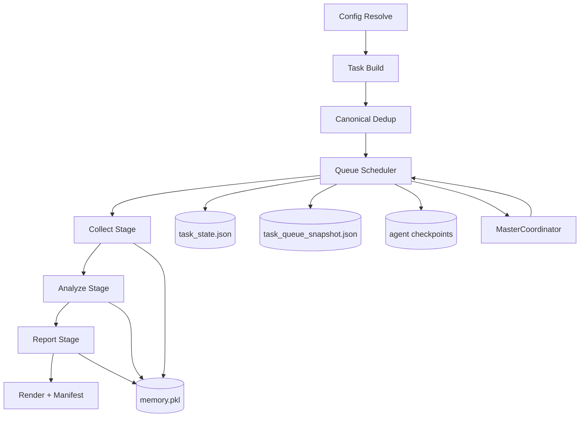

# FinSight

FinSight is a resumable, multi-agent research pipeline that runs **data collection -> analysis -> report generation** for a target (company, industry, macro, governance, or mixed profiles).

This README is the operator manual for running, resuming, repairing, and debugging long research runs.

## What This Project Is

FinSight is designed for long-running, interruption-prone research jobs.

It provides:
1. Profile-based task routing (for example `macro -> industry` execution order).
2. Multi-agent execution with checkpoints and memory persistence.
3. Deterministic resume/recovery tools (`--status`, `--doctor`, `--repair-resume`).
4. One synthesized report output from all completed evidence.
5. Run manifest metadata (`run_manifest.json`) for success/failure truth.

It is **not** a one-shot script. It is an orchestrated runtime with persistent state.

## End-to-End Pipeline



Runtime flow in detail:
1. Resolve config (`--planner` optional, profile router otherwise).
2. Build collect/analyze/report tasks from configured + generated task sets.
3. Canonical de-dup by stage/profile/task/target identity.
4. Execute queue with bounded concurrency.
5. Persist per-iteration state/checkpoints for each agent.
6. Master coordinator (enabled by default) can steer pending work.
7. Report generator composes final report from all accumulated evidence.
8. Write `run_manifest.json` with stage outcomes and artifact checks.

## Stage Behavior

### 1) Collect Stage (`data_collector`)

Purpose: gather structured datasets from tools/APIs and persist them to memory.

Core behavior:
- Uses tool-calling and code execution loop.
- Supports saving structured data via `save_result(...)`.
- Stores collected items into shared memory.

### 2) Analyze Stage (`data_analyzer`)

Purpose: turn collected datasets into analysis outputs (text + chart metadata).

Core behavior:
- Pulls data from memory (`get_existed_data(...)`).
- Can call deep search for missing evidence.
- Produces analysis text and chart references for report synthesis.

### 3) Report Stage (`report_generator`)

Purpose: create a single final report from all completed evidence.

Core behavior:
- Phase 0: outline generation.
- Phase 1: section drafting + final polish (section by section, checkpointed).
- Phase 2: post-processing and rendering.

Typical logs you will see:
- `[Phase0] Generating Report Outline`
- `[Phase1] Section N/M start`
- `[Phase1] Section N done`
- `[Phase1] Completed: All sections generated`
- `[Phase2] Begin post processing`

## Which Model/Provider Is Used Where

FinSight uses **OpenAI-compatible endpoints** from config/env.

Environment variables:
- `DS_MODEL_NAME`, `DS_BASE_URL`, `DS_API_KEY`
- `VLM_MODEL_NAME`, `VLM_BASE_URL`, `VLM_API_KEY`
- `EMBEDDING_MODEL_NAME`, `EMBEDDING_BASE_URL`, `EMBEDDING_API_KEY`

Default mapping in runtime:
1. `DS_MODEL_NAME` (`use_llm_name`)
- Primary reasoning model for collector/analyzer/report and deepsearch agent.

2. `VLM_MODEL_NAME` (`use_vlm_name`)
- Vision-language model for analyzer chart critique/caption tasks.

3. `EMBEDDING_MODEL_NAME` (`use_embedding_name`)
- Embedding/index retrieval tasks.

Notes:
- If `DS_MODEL_NAME=deepseek-chat` and `DS_BASE_URL=https://api.deepseek.com`, calls go to DeepSeek.
- You can switch providers by changing model/base_url/api_key values (OpenAI-compatible).

## Search Providers

Optional search API keys:
- `SERPER_API_KEY`
- `BOCHAAI_API_KEY`

If missing, web search quality/coverage may degrade; some tool calls may fail and retry.

## User-Callable Interfaces

### CLI Surface

Common commands:

```bash
# Profile-based run
python run_report.py --industry --macro

# Resume from resolved config
python run_report.py --resolved-input --config .runtime/my_config_resolved.yaml --continue --max-concurrent 6

# Status snapshot
python run_report.py --resolved-input --config .runtime/my_config_resolved.yaml --status

# Diagnose and repair
python run_report.py --resolved-input --config .runtime/my_config_resolved.yaml --doctor
python run_report.py --resolved-input --config .runtime/my_config_resolved.yaml --repair-resume
```

Key flags:
- `--continue` (alias of `--resume`)
- `--no-resume`
- `--max-concurrent N`
- `--resume-stalled-only`
- `--status`
- `--doctor`
- `--repair-resume`
- `--master-enabled` / `--no-master`
- `--master-health-interval-sec 30`
- `--master-auto-recover` / `--no-master-auto-recover`
- `--master-stall-seconds 900`
- `--master-escalation-cooldown-sec 180`
- `--master-allow-drop` / `--no-master-allow-drop`
- `--pdf-mode auto|force|skip`
- `--planner`

### In-Agent Code Helper Functions (by stage)

Base helper (available where code executor is initialized):
- `call_tool(tool_name="...", **kwargs)`

Collector stage helpers:
- `call_tool(...)`
- `save_result(data_or_var, name, description, source)`
  - Also supports keyword form: `save_result(data=..., name=..., description=..., source=...)`

Analyzer stage helpers:
- `get_existed_data(data_id)`
- `get_data_from_deep_search(query)`
- `collect_data_list` (session variable)
- `session_output_dir` (chart output dir)

Report stage helpers:
- `get_data(data_id)`
- `get_analysis_result(analysis_id)`
- `get_data_from_deep_search(query)`

Important:
- Helpers are stage-specific. Calling `save_result(...)` outside collector context can raise `NameError`.

## State, Files, and Artifacts

Typical working directory:
- `<output_dir>/<target_name>/`

Key files:
- `memory/memory.pkl`
- `agent_working/<agent_id>/.cache/*.pkl`
- `logs/finsight.log`
- `state/task_state.json`
- `state/task_queue_snapshot.json`
- `state/master_state.json`
- `state/master_health.json`
- `state/master_escalations.jsonl`
- `state/live_run_state.json`
- `state/recovery_report.json`

Run manifest (global per output root):
- `<output_dir>/run_manifest.json`

## Master Autonomy Model (Guided Auto Default)

Default policy is **Guided Auto**:

Allowed by default:
1. `REWRITE_GUIDANCE`
2. `REPRIORITIZE_TASK`
3. `REQUEST_RETRY`
4. bounded `ADD_TASK` (stage and total growth caps)

Blocked by default:
1. `DROP_TASK`

`DROP_TASK` behavior:
1. Disabled unless `--master-allow-drop` is explicitly set.
2. Even when enabled, only applies to `pending` tasks and high-confidence mutations.

Policy visibility:
1. Persisted in `state/master_state.json` under `policy`.
2. Exposed in `--status` master snapshot.

## Autonomous Health Monitoring

Master watchdog writes `state/master_health.json` during active runs.

Fields:
1. `health_status`: `healthy | degraded | critical`
2. `stall_risk_score`: deterministic 0-100 risk score
3. `oldest_running_checkpoint_age_sec`
4. `time_since_last_completion_sec`
5. `active_recovery_action`
6. doctor counts (`stale`, `recoverable`, `orphaned`, `missing_checkpoints`)

Escalation trace:
1. `state/master_escalations.jsonl` (append-only)
2. includes reason, action, confidence, and target keys

Auto-recovery trigger defaults:
1. `--master-auto-recover` enabled
2. stale threshold `--master-stall-seconds 900`
3. escalation throttle `--master-escalation-cooldown-sec 180`

## Agent Filesystem Permission Model

Agent-generated Python code runs inside the sandboxed code executor with mutation guards.

Write/mutation is allowed only in:
1. `<working_dir>/state`
2. `<working_dir>/memory`
3. `<working_dir>/agent_working`
4. run output root report artifacts (`.md/.docx/.pdf/.png`) only

Blocked outside scoped roots:
1. `open(..., "w/a/x/+")`
2. `os.remove`, `os.unlink`, `os.rename`, `os.replace`
3. `os.rmdir`, `os.mkdir`, `os.makedirs`

Result on violation:
1. `PermissionError`
2. concise sandbox warning in logs with attempted path/op

This applies to agent-executed code, not the core runner writing its own state.

## Resume and Recovery Runbook

### 1) Check progress snapshot

```bash
python run_report.py --resolved-input --config .runtime/my_config_resolved.yaml --status
```

### 2) Diagnose run health

```bash
python run_report.py --resolved-input --config .runtime/my_config_resolved.yaml --doctor
```

### 3) Repair resume state

```bash
python run_report.py --resolved-input --config .runtime/my_config_resolved.yaml --repair-resume
```

### 4) Continue normal execution

```bash
python run_report.py --resolved-input --config .runtime/my_config_resolved.yaml --continue --max-concurrent 2
```

### 5) Resume only stalled tasks

```bash
python run_report.py --resolved-input --config .runtime/my_config_resolved.yaml --resume-stalled-only --max-concurrent 2
```

### 6) Continue without master steering (stability path)

```bash
python run_report.py --resolved-input --config .runtime/my_config_resolved.yaml --continue --no-master --max-concurrent 2
```

### 7) Watch master health during long runs

```bash
python run_report.py --resolved-input --config .runtime/my_config_resolved.yaml --status
```

Interpretation:
1. `healthy`: no current stall indicators.
2. `degraded`: some stall/recovery pressure; monitor.
3. `critical`: likely stall or repeated failures; expect/verify auto-recovery events.

## Debugging Guide (Symptoms -> Cause -> Action)

### A) `Input data must contain a 'task' key`

Symptom:
- collector/search/report task fails immediately with missing `task` key.

Likely cause:
- stale or malformed queue/task mapping entry in resumed state.

Action:
1. Run `--doctor`.
2. Run `--repair-resume`.
3. Continue with resolved config.

### B) `NameError: save_result is not defined`

Symptom:
- generated code in non-collector context tries `save_result(...)`.

Cause:
- `save_result` is collector-only helper; stage mismatch.

Action:
- Retry stage in proper context, or rely on stage-specific helper functions.
- For report/analyze, use `get_data*` interfaces and standard output flow.

### C) `Prompt must contain the word 'json' ... response_format=json_object`

Symptom:
- 400 error in search/deepsearch/model response formatting.

Cause:
- provider-specific constraint with JSON response format.

Action:
- Retry; ensure prompt path includes JSON directive if applicable.
- If persistent, switch provider/model or adjust prompt templates.

### D) Repeated `Connection error` in LLM retries

Symptom:
- `All model attempts failed after retries. Last error: Connection error`.

Cause:
- upstream model endpoint/network instability.

Action:
1. Re-run continue command after short wait.
2. Lower concurrency (`--max-concurrent 1`).
3. Use `--no-master` to minimize additional runtime churn.

### E) Repeated deepsearch loops / similar output returned repeatedly

Symptom:
- search agent keeps producing near-duplicate concentration summaries.

Cause:
- search provider result homogeneity or insufficient query diversity.

Action:
- Let section loop continue if section outputs are still progressing.
- If stalled, rerun with lower concurrency and/or alternate search provider keys.

### F) `--status` says 100% but run still failed

Symptom:
- status snapshot shows done, but recent run summary is failed.

Cause:
- `--status` is derived from checkpoint/task-state classification, not strict latest-manifest artifact validation.

Action:
- Always verify `run_manifest.json` + real report artifact existence.

### G) `No .md report file produced`

Symptom:
- run manifest marks incomplete with missing markdown report.

Cause:
- report stage failed before final write, even if progress looked high.

Action:
1. Continue from report stage.
2. Validate model connectivity.
3. Re-check manifest success.

### H) Title/Introduction is off-topic vs report body

Symptom:
- H1 title or opening introduction talks about a different domain than the generated sections.

Cause:
- prompt pack for title/introduction did not bind strongly to report body context.

Action:
1. Pull latest code with grounded title/introduction prompts.
2. Re-run only report stage with `--continue --no-master --max-concurrent 1`.
3. Validate first lines of `.md` plus section headers before final distribution.

## Completion Truth (Authoritative Checks)

Do **not** treat `--status` alone as final completion.

Final completion requires all of:
1. `run_manifest.json` has `"success": true`
2. `run_manifest.json` has `"missing": []`
3. Report artifact(s) exist (`.md` minimum; `.docx` usually present; `.pdf` depends on `--pdf-mode` and environment)

Quick checks:

```bash
.venv/bin/python run_report.py --resolved-input --config .runtime/my_config_resolved.yaml --status

python - <<'PY'
import json
m = json.load(open('outputs/global-semiconductor-industry/run_manifest.json'))
print('run_id:', m.get('run_id'))
print('success:', m.get('success'))
print('missing:', m.get('missing'))
print('stages:', {k:v.get('status') for k,v in m.get('stages', {}).items()})
PY
```

## PDF Behavior

`--pdf-mode`:
- `auto`: attempt PDF conversion; continue if unavailable.
- `force`: fail run if PDF conversion fails.
- `skip`: skip PDF conversion.

## Operational Tips

1. Keep using one resolved config path per topic for stable resume semantics.
2. Prefer `--doctor` + `--repair-resume` before manual state edits.
3. Lower concurrency during provider instability.
4. Use `--continue --no-master` when you need deterministic finishing on nearly-complete runs.
5. Track non-trivial fixes in:
   - `docs/BUG_LOG.md`
   - `docs/IMPROVEMENTS_LOG.md`

## Contributor Pointers

Primary runtime files:
- `run_report.py`
- `src/agents/base_agent.py`
- `src/agents/data_collector/data_collector.py`
- `src/agents/data_analyzer/data_analyzer.py`
- `src/agents/report_generator/report_generator.py`
- `src/utils/recovery.py`
- `src/utils/run_manifest.py`
- `src/orchestration/master_coordinator.py`
