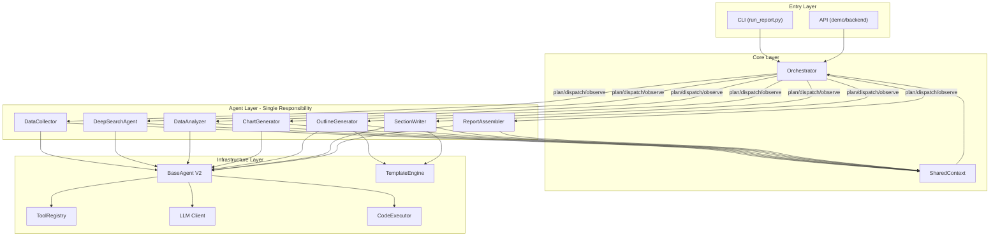
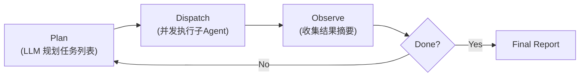
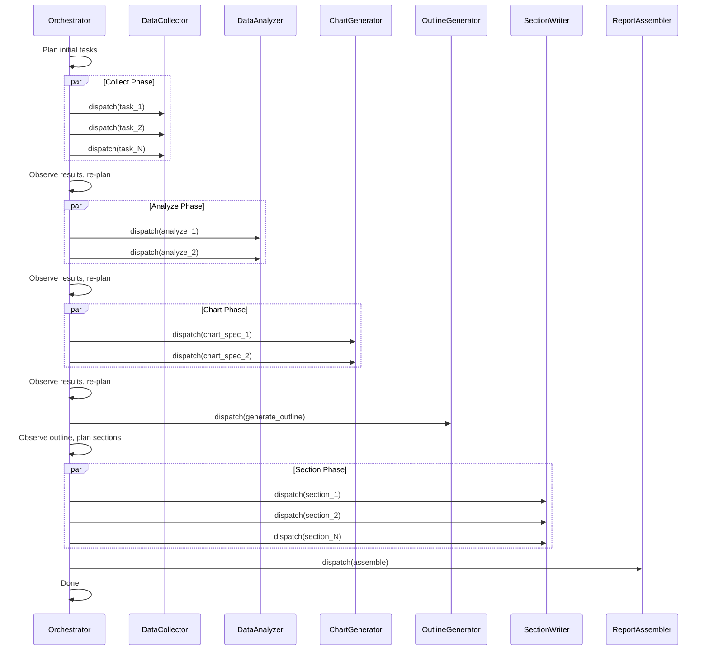
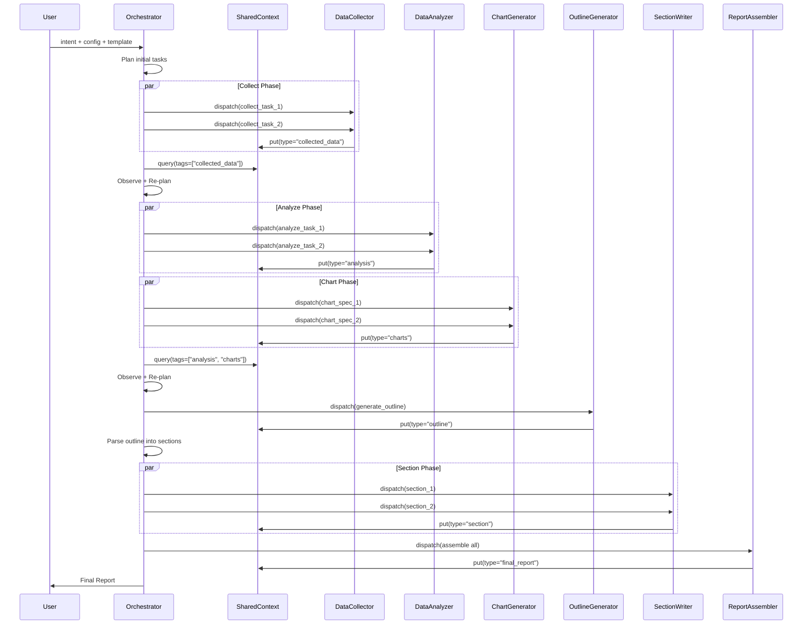

# FinSight V2 重构方案

## 一、现状问题诊断

基于对全部核心模块的分析（约 3500 行核心代码），当前系统存在以下关键问题：

### 1. 架构层面

- **硬编码线性流水线**：[run_report.py](run_report.py) 中 Priority 1→2→3 固定分组，无法动态调整任务顺序或新增阶段
- **Agent 协议不统一**：`BaseAgent` 同时支持 `<execute>/<final_result>/<search>/<click>/<report>/<outline>/<draft>` 多种动作标签，`DeepSearchAgent` 走专用 handler (`enable_code=False`)，其他 Agent 走 code-driven
- **Memory 承担过多职责**：[src/memory/variable_memory.py](src/memory/variable_memory.py)（393 行）同时负责数据存储、Agent 生命周期管理、LLM 任务生成、嵌入检索，耦合严重

### 2. 代码层面

- **`asyncio.run()` 嵌套风险**：`DataAnalyzer._get_deepsearch_result` 在异步上下文中使用 `asyncio.run()`，可能死锁
- **数据重复写入**：`DataCollector._save_result` 同时写 `memory.add_data()` 和 `collected_data_list`，`async_run` 结束后再次写入
- **`isinstance` 分发泛滥**：`Memory.get_collect_data()`、`ReportGenerator` 中大量 `isinstance(item, ClickResult/SearchResult/DeepSearchResult)` 硬编码类型判断
- **拼写错误和 bug**：`coversation_history` 拼写错误、`Report` 类缺少 `logger` 属性、`_repalce_image_name` 等

### 3. 扩展性层面

- **报告类型硬编码**：Prompt 按 `financial_company/macro/industry/general` 四种固定类型分发，新增类型需改多处代码
- **无任务注入机制**：用户无法在运行时动态调整分析方向
- **无人机协同接口**：全自动执行，无审核/干预点

---

## 二、目标架构

### 整体架构图



### 核心设计原则

1. **协议统一**：所有 Agent 仅使用 `<execute>` + `<final_result>` 两种动作标签
2. **单一职责**：每个 Agent 只做一件事，不在内部维护多阶段工作流；阶段编排由 Orchestrator 负责
3. **职责分离**：拆分 Memory 为 SharedContext（纯数据）+ Orchestrator（调度）+ AgentRegistry（生命周期）
4. **模板驱动**：报告结构由模板定义，而非代码硬编码
5. **显式数据流**：Agent 产出通过类型化的 `AgentResult` 写入 SharedContext，消费方通过声明式查询读取

---

## 三、核心模块设计

### 3.1 BaseAgent V2（重构 [src/agents/base_agent.py](src/agents/base_agent.py)）

**目标**：从 853 行精简到 ~400 行，移除所有业务相关 handler。

关键变更：

- 仅保留 `_handle_code_action` 和 `_handle_final_action` 两个 handler
- 统一 `call_tool` 接口，增加 `ToolCallRecord` 结构化日志
- 将 `_agent_tool_function` 中硬编码的 rate-limit 服务名改为 Tool 元数据声明
- 移除 `print()` 调用，统一使用 logger
- 修复 `coversation_history` 拼写错误

```python
# 精简后的 BaseAgent 核心接口
class BaseAgent:
    async def async_run(self, input_data: dict, max_iterations: int = 20, 
                        resume: bool = False) -> AgentResult:
        """统一入口：prepare → loop(llm → parse → execute) → result"""

    def _parse_llm_response(self, response: str) -> Action:
        """仅识别 <execute> 和 <final_result>"""

    async def _handle_code_action(self, code: str) -> str:
        """在沙箱中执行 LLM 生成的 Python，call_tool 为唯一外部交互方式"""

    async def _handle_final_action(self, content: str) -> AgentResult:
        """包装最终结果"""
```

### 3.2 SharedContext（替代当前 Memory 的数据存储部分）

**目标**：纯粹的数据容器，不承担 Agent 管理和任务生成职责。

```python
class SharedContext:
    """类型化的共享数据空间"""
    
    def put(self, key: str, value: AgentResult, tags: list[str] = None): ...
    def get(self, key: str) -> AgentResult: ...
    def query(self, tags: list[str] = None, result_type: str = None) -> list[AgentResult]: ...
    def save(self, path: str): ...
    def load(self, path: str): ...

class AgentResult:
    """统一的 Agent 产出类型"""
    agent_id: str
    result_type: str      # "collected_data" | "analysis" | "search" | "report_section"
    content: Any           # 实际数据
    metadata: dict         # 来源、耗时、工具调用记录等
    summary: str           # LLM 生成的摘要，供下游消费
```

### 3.3 Agent 拆分设计（核心变更）

当前 `DataAnalyzer`（597 行）和 `ReportGenerator`（683 行）内部各自维护了复杂的多阶段工作流，导致单个 Agent 职责过重、难以复用和测试。将它们拆分为单一职责的原子 Agent，由 Orchestrator 在上层编排组合。

#### 拆分前后对比

**DataAnalyzer 拆分**（597 行 → 2 个 Agent，共 ~300 行）：

| 原内部阶段 | 新 Agent | 职责 | 预计行数 |
|-----------|---------|------|---------|
| phase1: 对话式分析 + phase2: 解析报告 | **DataAnalyzer** (精简) | 基于收集数据进行 code-driven 分析，输出分析报告文本 + 图表规格 | ~150 行 |
| phase3: 图表生成（VLM 反馈循环） + phase4: 描述生成 | **ChartGenerator** (新增) | 接收图表规格 + 数据，生成图表图片（含 VLM critique 迭代），输出图片路径 + 描述 | ~150 行 |

**ReportGenerator 拆分**（683 行 → 3 个 Agent，共 ~400 行）：

| 原内部阶段 | 新 Agent | 职责 | 预计行数 |
|-----------|---------|------|---------|
| Phase 0: generate_outline (draft→critique→refine) | **OutlineGenerator** (新增) | 基于分析结果 + 模板生成报告大纲，输出 Report 对象 | ~100 行 |
| Phase 1: 逐 section 撰写 + polish | **SectionWriter** (新增) | 接收单个 section 的 outline，基于数据撰写内容，输出 section 文本 | ~150 行 |
| Phase 2: post_process (图片替换/摘要/封面/参考文献/渲染) | **ReportAssembler** (新增) | 组装所有 section，替换图片引用，生成摘要/封面/参考文献，导出 MD/DOCX/PDF | ~150 行 |

#### 新 Agent 完整清单

| Agent | 来源 | 输入 | 输出 |
|-------|------|------|------|
| **DataCollector** | 保留（简化） | 收集任务描述 | `AgentResult(type="collected_data")` |
| **DeepSearchAgent** | 保留（改 code-driven） | 搜索查询 | `AgentResult(type="search_result")` |
| **DataAnalyzer** | 拆分精简 | 分析任务 + 收集数据引用 | `AgentResult(type="analysis", content={report_text, chart_specs})` |
| **ChartGenerator** | 从 DataAnalyzer 拆出 | 图表规格 + 数据 + VLM 配置 | `AgentResult(type="charts", content={paths, descriptions, code})` |
| **OutlineGenerator** | 从 ReportGenerator 拆出 | 任务描述 + 分析摘要 + 模板 | `AgentResult(type="outline", content=Report)` |
| **SectionWriter** | 从 ReportGenerator 拆出 | section outline + 数据/分析引用 | `AgentResult(type="section", content=section_text)` |
| **ReportAssembler** | 从 ReportGenerator 拆出 | Report 对象 + 所有 section + 图表 | 最终报告文件（MD/DOCX/PDF） |

### 3.4 Orchestrator（新增 [src/agents/orchestrator/orchestrator.py](src/agents/orchestrator/orchestrator.py)）

**目标**：替代 `run_report.py` 中的硬编码流水线，实现 Plan→Execute→Observe→Re-plan 闭环。

**设计理念**：不引入复杂的图运行时（TaskGraph/GraphPatch/NodeState），而是用一个 Meta-Agent 通过 LLM 驱动的循环来实现动态编排。Agent 粒度更细后，Orchestrator 的编排能力更为关键——它决定何时并发、何时串行、何时补充任务。



**核心动作空间**：

- `plan(tasks: list[TaskSpec])` — 生成/更新任务计划
- `dispatch(agent_type, input_data)` — 调用子 Agent（支持并发）
- `stop(summary)` — 结束编排

**子 Agent 映射**（固定，不动态注册）：

- `collect` → `DataCollector`
- `analyze` → `DataAnalyzer`
- `deep_search` → `DeepSearchAgent`
- `chart` → `ChartGenerator`
- `outline` → `OutlineGenerator`
- `section` → `SectionWriter`
- `assemble` → `ReportAssembler`

**典型编排流程**（Orchestrator 自主规划，以下为期望行为而非硬编码）：



### 3.5 TemplateEngine（新增 [src/templates/engine.py](src/templates/engine.py)）

**目标**：用户提供报告模板文件夹，系统自动适配 prompt 和报告结构。

```
templates/
├── financial_company/
│   ├── meta.yaml          # 模板元信息：名称、适用条件、所需数据类型
│   ├── outline.md         # 大纲模板
│   ├── collect.yaml       # 默认收集任务
│   ├── analyze.yaml       # 默认分析任务
│   └── prompts/           # 覆盖默认 prompt
├── macro_economy/
│   └── ...
└── custom_example/        # 用户自定义
    └── ...
```

```python
class TemplateEngine:
    def load_template(self, template_dir: str) -> ReportTemplate: ...
    def get_collect_tasks(self, template: ReportTemplate, target: str) -> list[str]: ...
    def get_analyze_tasks(self, template: ReportTemplate, target: str) -> list[str]: ...
    def get_outline_prompt(self, template: ReportTemplate) -> str: ...
    def get_section_prompt(self, template: ReportTemplate, section: Section) -> str: ...
```

### 3.6 代码量变化预估

| 模块 | 现状行数 | 重构后行数 | 变化 |
|------|---------|-----------|------|
| BaseAgent | 853 | ~400 | -53% |
| DataCollector | 164 | ~100 | -39% |
| DeepSearchAgent | 334 | ~150 | -55% |
| DataAnalyzer | 597 | ~150 (拆分后) | -75% |
| ChartGenerator | (新增) | ~150 | new |
| OutlineGenerator | (新增) | ~100 | new |
| SectionWriter | (新增) | ~150 | new |
| ReportAssembler | (新增) | ~150 | new |
| ReportGenerator | 683 | 删除（拆分为上面 3 个） | -100% |
| Orchestrator | (新增) | ~300 | new |
| SharedContext | (新增) | ~150 | new |
| types.py | (新增) | ~80 | new |
| **合计** | ~2631 | ~1880 | -29% |

拆分后每个 Agent 平均 ~140 行，职责单一，可独立测试。

### 3.7 执行层优化：CodeExecutor + LLM Client（重构 [src/utils/](src/utils/)）

当前执行层存在路径隔离不完整、性能瓶颈和稳定性风险，需要系统性优化。

#### 3.7.1 CodeExecutor 问题诊断与优化方案

**问题 1：路径隔离不完整 — 文件保存到错误路径（P0）**

当前 `_restricted_open` 仅允许写入 `self.working_dir`（即 `.executor_cache`），但 `session_output_dir` 被设为 `working_dir/../images`，位于沙箱之外。同时没有调用 `os.chdir()`，导致相对路径基于进程 CWD 解析而非沙箱目录。

```python
# 当前问题路径关系
agent_working/<agent_id>/
├── .executor_cache/     ← self.working_dir（沙箱允许写入范围）
└── images/              ← session_output_dir（在沙箱之外，写入会被拦截或走错路径）
```

**修复方案**：
- 将沙箱允许写入范围提升到 agent 工作目录级别（`.executor_cache` 的父目录），而非仅限 `.executor_cache`
- 在每次 `execute()` 前设置 `os.chdir(self.working_dir)`，确保相对路径解析正确
- 在 `execute()` 结束后恢复原始 CWD（使用 `try/finally`）
- 将 `session_output_dir` 统一由 BaseAgent 传入，不再由各子 Agent 自行计算

```python
class AsyncCodeExecutor:
    def __init__(self, working_dir: str, allowed_write_dir: str = None, ...):
        self.working_dir = working_dir
        # 允许写入范围：默认为 working_dir，可扩大到 agent 级目录
        self.allowed_write_dir = allowed_write_dir or working_dir
```

**问题 2：每次执行都注入 matplotlib header（性能）**

当前每次 `execute()` 都在代码前拼接 matplotlib 配置行，产生不必要的开销。

**修复方案**：在 `create_clean_globals()` 中一次性配置好 matplotlib（已部分做了），删除 `execute()` 中的 header 拼接。

**问题 3：`async_main` 无超时保护（稳定性）**

如果用户代码定义了 `async def async_main()`，当前直接 `await` 而无超时限制，可能无限挂起。

**修复方案**：用 `asyncio.wait_for(self.globals['async_main'](), timeout=self.exec_timeout)` 包裹。

**问题 4：`print()` 在生产代码中泄露（代码质量）**

`execute()` 中 `print("error code: code = \n", code)` 直接输出到真实 stdout，绕过了 capture。

**修复方案**：替换为 `_sandbox_logger.error(...)`。

**问题 5：`save_state` 对大对象序列化缓慢（性能）**

对 DataFrame 等大对象使用 `dill.dumps()` 逐个序列化，耗时且内存占用高。

**修复方案**：
- 对 DataFrame 使用 `parquet` 或 `feather` 格式落盘，不走 dill
- 增加大小阈值：超过阈值的变量只保存引用/摘要，不完整序列化
- 提供 `skip_patterns` 参数，允许调用方排除不需要持久化的变量

**问题 6：默认线程池共享（性能）**

`loop.run_in_executor(None, sync_exec)` 使用默认 `ThreadPoolExecutor`，所有代码执行共享线程池，高负载时互相阻塞。

**修复方案**：为 CodeExecutor 创建独立的 `ThreadPoolExecutor(max_workers=N)`，生命周期与 executor 绑定。

#### 3.7.2 LLM Client 优化方案

**问题 1：无 streaming 支持（性能 — P0）**

当前使用 `chat.completions.create()` 完整等待响应，长文本生成时前端和下游处理无法提前开始。

**修复方案**：
- `AsyncLLM.generate()` 增加 `stream: bool = False` 参数
- 当 `stream=True` 时，使用 `AsyncIterator` 返回增量 token，调用方可 `async for chunk in llm.stream(...)`
- BaseAgent 的 `async_run` 循环中使用 streaming 读取，解析到完整的 `<execute>` 或 `<final_result>` 标签后立即执行，不等全部生成完

**问题 2：无响应缓存（性能）**

同一 prompt（如 outline critique 多轮调用中的系统 prompt）每次都走 API 请求。

**修复方案**：
- 增加可选的基于 prompt hash 的磁盘缓存（LRU，容量可配）
- 缓存粒度为 `(model_name, messages_hash, params_hash) → response`
- 仅在 `temperature=0` 或明确开启时启用
- 配置项：`config.yaml` 中增加 `llm_cache: {enabled: true, max_size_mb: 500}`

**问题 3：无并发限制（稳定性）**

多个 Agent 同时调用 LLM 时没有全局并发控制，可能触发 API 限频。

**修复方案**：
- 在 `AsyncLLM` 层增加 `asyncio.Semaphore(max_concurrent)` 参数
- 与现有 `RateLimiter` 配合：RateLimiter 控制最小调用间隔，Semaphore 控制并发上限
- 默认值可从 `config.yaml` 的 `rate_limits` 中读取

**问题 4：context overflow 处理方式不安全（稳定性）**

当前在 400 错误时直接 `messages.pop()` 修改传入的 messages 列表，可能影响调用方。同步 `LLM` 使用递归调用重试，深对话可能爆栈。

**修复方案**：
- 操作副本而非原始 messages：`messages = messages.copy()` 后再 pop
- 同步 `LLM.generate` 改为循环重试而非递归
- 增加最大移除次数上限（如 3 次），避免无限 pop

**问题 5：`print()` 替换为 logger（代码质量）**

所有 `print("Error in AsyncLLM.generate: ...")` 替换为 `logger.warning/error`。

#### 3.7.3 AsyncBridge 优化方案

**问题：单线程瓶颈**

当前 `AsyncBridge` 使用单线程 + 单事件循环，所有 `run_async()` 调用串行执行。当多个 Agent 的 `call_tool` 同时调用 DeepSearchAgent 时，互相阻塞。

**修复方案**：
- Agent 拆分后，DeepSearchAgent 不再在 code executor 的 sync 上下文中被调用（改为 Orchestrator 直接 dispatch）
- 对于仍需 sync→async bridge 的场景，使用线程池化的 bridge（每次 `run_async` 可在独立线程上运行）
- 长期目标：消除 AsyncBridge 依赖，所有 Agent 间交互都走 Orchestrator 的 async dispatch

#### 3.7.4 清理遗留执行器

删除 `code_executor.py`（314 行）和 `code_executor_legacy.py`（329 行），代码库中未使用，消除维护负担。

---

## 四、数据流设计



---

## 五、新旧目录结构对比

```
src/
├── agents/
│   ├── base_agent.py              # 精简：853→~400 行
│   ├── types.py                   # 新增：AgentResult, ToolCallRecord, Action
│   ├── orchestrator/              # 新增：Meta-Agent
│   │   ├── orchestrator.py        # ~300 行
│   │   └── prompts.yaml
│   ├── data_collector/            # 简化：164→~100 行
│   │   ├── data_collector.py
│   │   └── prompts/
│   ├── data_analyzer/             # 拆分精简：597→~150 行
│   │   ├── data_analyzer.py
│   │   └── prompts/
│   ├── chart_generator/           # 新增（从 DataAnalyzer 拆出）
│   │   ├── chart_generator.py     # ~150 行
│   │   └── prompts/
│   ├── outline_generator/         # 新增（从 ReportGenerator 拆出）
│   │   ├── outline_generator.py   # ~100 行
│   │   └── prompts/
│   ├── section_writer/            # 新增（从 ReportGenerator 拆出）
│   │   ├── section_writer.py      # ~150 行
│   │   └── prompts/
│   ├── report_assembler/          # 新增（从 ReportGenerator 拆出）
│   │   ├── report_assembler.py    # ~150 行（后处理/渲染，非 LLM agent）
│   │   └── report_class.py        # 迁移自 report_generator/
│   └── search_agent/              # 统一为 code-driven：334→~150 行
│       ├── search_agent.py
│       └── prompts/
├── context/                       # 新增（替代 memory/）
│   ├── shared_context.py          # 纯数据存储
│   └── checkpoint.py              # 检查点管理
├── templates/                     # 新增
│   ├── engine.py                  # 模板加载与适配
│   └── builtin/                   # 内置模板
├── tools/                         # 小幅清理
│   ├── base.py                    # 增加 rate_limit_group 元数据
│   └── ...
├── config/
│   ├── config.py
│   └── default_config.yaml
└── utils/                         # 基本不变
    └── ...
```

---

## 六、与旧 stage0_plan.md 的关键差异

| 方面 | 旧方案 | 新方案 | 理由 |
|------|--------|--------|------|
| 编排方式 | TaskGraph + GraphPatch + Scheduler + Runtime (~1000 行新增) | Orchestrator Meta-Agent (~300 行) | 图运行时引入大量抽象（TaskNode, NodeState, GraphPatch 校验/环检测），当前规模无需如此复杂；Meta-Agent 用 LLM 推理替代硬编码图逻辑，更灵活且实现量小 |
| Agent 粒度 | 保持 4 个大 Agent（DataCollector/DataAnalyzer/ReportGenerator/DeepSearchAgent） | 拆分为 7 个原子 Agent | 消除 Agent 内部多阶段状态机，每个 Agent 单一职责，可独立测试，Orchestrator 获得更细粒度调度能力 |
| 变量隔离 | 节点隔离 + publish/read 显式导出 | SharedContext 统一读写 + tag 过滤 | 当前仅 7 个 Agent 类型，节点级隔离过度；SharedContext 的 tag 机制足够清晰 |
| 失败策略 | 全局 fail-fast | Orchestrator LLM 决策 | 让 LLM 判断"此失败是否致命"更灵活，避免因一个非关键任务失败导致全部停止 |
| 改造范围 | 一次切换 V2，旧路径全删 | 分层渐进，保持向后可测 | 降低风险，每一步都可独立验证 |

---

## 七、分步实施计划

### Phase 1：地基加固 + 执行层修复（~2.5 天）

重点：清理 BaseAgent 协议 + 修复 CodeExecutor 路径隔离 + LLM Client 稳定性。这一步不改变外部行为，只做内部加固。

**BaseAgent 协议统一：**
- 精简 `BaseAgent`：移除 `<search>/<click>/<report>/<outline>/<draft>` handler，仅保留 `<execute>` + `<final_result>`
- 新增 `src/agents/types.py`：定义 `AgentResult`、`ToolCallRecord`、`Action`
- 修复所有已知 bug（`coversation_history` 拼写、`Report.logger` 缺失、`_repalce_image_name` 拼写、`asyncio.run` 嵌套）
- 统一 DeepSearchAgent 为 code-driven（`enable_code=True`），search/click 全走 `call_tool`

**CodeExecutor 路径隔离修复（P0）：**
- 修复 `_restricted_open`：将允许写入范围从 `.executor_cache` 扩大到 agent 工作目录（`allowed_write_dir` 参数）
- 每次 `execute()` 前 `os.chdir(self.working_dir)`，执行后恢复（`try/finally`）
- 删除 `execute()` 中的 matplotlib header 拼接（已在 `create_clean_globals` 中配置）
- 为 `async_main` 增加 `asyncio.wait_for` 超时保护
- `print(...)` 替换为 `_sandbox_logger.error(...)`
- 删除 `code_executor.py` 和 `code_executor_legacy.py`（未使用）

**LLM Client 稳定性修复：**
- context overflow 时操作 messages 副本而非原始列表
- 同步 `LLM.generate` 递归重试改为循环 + 最大移除次数限制
- `print(...)` 替换为 `logger`
- `bare except` 替换为 `except Exception`

### Phase 2：Agent 拆分（~2.5 天）

重点：将 DataAnalyzer 和 ReportGenerator 拆分为单一职责 Agent。这是本次重构最关键的架构变更。

**从 DataAnalyzer（597 行）拆出 ChartGenerator：**

- 新建 `src/agents/chart_generator/chart_generator.py`
- 将 `_draw_chart`、`_draw_single_chart`、`_generate_and_execute_code`、`_generate_description` 迁移到 ChartGenerator
- DataAnalyzer 精简为：对话式分析 → 输出分析报告文本 + 图表规格列表（不再自己画图）
- 修复 `asyncio.run()` 嵌套问题，统一使用 async bridge

**从 ReportGenerator（683 行）拆出 3 个 Agent：**

- 新建 `src/agents/outline_generator/outline_generator.py`：迁移 `generate_outline`、`_prepare_outline_prompt`
- 新建 `src/agents/section_writer/section_writer.py`：迁移 per-section 写作逻辑 + `_final_polish`
- 新建 `src/agents/report_assembler/report_assembler.py`：迁移 `post_process_report`（图片替换、摘要、封面、参考文献、渲染）
- 删除原 `ReportGenerator`，其职责由 Orchestrator 编排上面 3 个 Agent 来替代

**验收标准：** 每个新 Agent 可独立运行和测试，平均 ~140 行，无内部多阶段状态机。

### Phase 3：数据层重构（~1.5 天）

重点：拆分 Memory，建立清晰的数据流。

- 新增 `src/context/shared_context.py`：纯数据容器，支持 `put/get/query` + tag 过滤
- 从 `variable_memory.py` 提取数据存储逻辑到 SharedContext
- 从 `variable_memory.py` 提取检查点逻辑到 `checkpoint.py`
- 统一结果类型：用 `AgentResult` 替代 `ToolResult/AnalysisResult/DeepSearchResult` 的 `isinstance` 分发
- 保留 `Memory` 作为薄兼容层（内部代理到 SharedContext），确保过渡期现有流程不断

### Phase 4：引入 Orchestrator（~2 天）

重点：用 Orchestrator 替代 run_report.py 中的硬编码流水线。

- 新增 `src/agents/orchestrator/`
- 实现 Plan→Dispatch→Observe→Re-plan 循环
- 注册全部 7 个子 Agent 映射：collect/analyze/chart/outline/section/assemble/deep_search
- 改造 `run_report.py` 为 Orchestrator 入口
- 支持 `--intent` 自然语言任务注入
- 并发控制：Orchestrator 在 dispatch 时支持 `parallel=True` 批量下发同级任务

### Phase 5：模板系统（~1.5 天）

重点：报告模板化，解耦报告类型与代码。

- 新增 `src/templates/`
- 将现有 prompt YAML 重组为模板结构
- OutlineGenerator 和 SectionWriter 接入 TemplateEngine
- 将 `financial_company/macro/industry` 转换为内置模板
- ReportAssembler 通过模板配置决定是否生成封面/摘要/参考文献（而非代码中硬编码 `target_type` 分支）

### Phase 6：执行层性能优化（~1.5 天）

重点：在架构稳定后，进行执行层性能提升。

**LLM Client 性能优化：**
- `AsyncLLM.generate()` 增加 `stream=True` 支持，返回 `AsyncIterator`
- BaseAgent 的 `async_run` 循环中使用 streaming，解析到完整标签后立即执行
- 增加可选的 prompt hash 磁盘缓存（`temperature=0` 时启用）
- 增加 `asyncio.Semaphore(max_concurrent)` 全局并发控制，与 RateLimiter 配合

**CodeExecutor 性能优化：**
- 为 CodeExecutor 创建独立 `ThreadPoolExecutor`，不共享默认线程池
- `save_state` 对 DataFrame 使用 parquet 格式落盘，避免 dill 序列化大对象
- 增加变量大小阈值，超过阈值的跳过序列化

**AsyncBridge 优化：**
- Agent 拆分后大部分跨 Agent 调用走 Orchestrator async dispatch，减少对 AsyncBridge 的依赖
- 剩余场景改用线程池化 bridge，消除单线程瓶颈

### Phase 7：收尾与验收（~1 天）

- 清理废弃代码（旧 Memory 兼容层、旧 ReportGenerator、未使用的 import 等）
- 完善 CLI 参数（argparse 替代硬编码全局变量 `IF_RESUME`/`MAX_CONCURRENT`）
- 更新文档和配置示例
- 端到端回归测试：至少 1 个 financial_company 报告 + 1 个 general 报告

---

## 八、风险控制

1. **质量回归风险**：Phase 1-2 完成后立即跑一次完整报告生成，与旧版对比；每个 Phase 都保持可运行状态
2. **过度抽象风险**：不引入 TaskGraph/GraphPatch/NodeState 等重型抽象；Orchestrator 保持极简（3 个动作）
3. **Prompt 回归风险**：Phase 1 统一协议时，先在一个 Agent 上验证 prompt 效果，再推广到全部
4. **检查点不兼容**：Phase 2 切换数据层时提供 migration 脚本，或明确声明不兼容旧 checkpoint（推荐后者）
